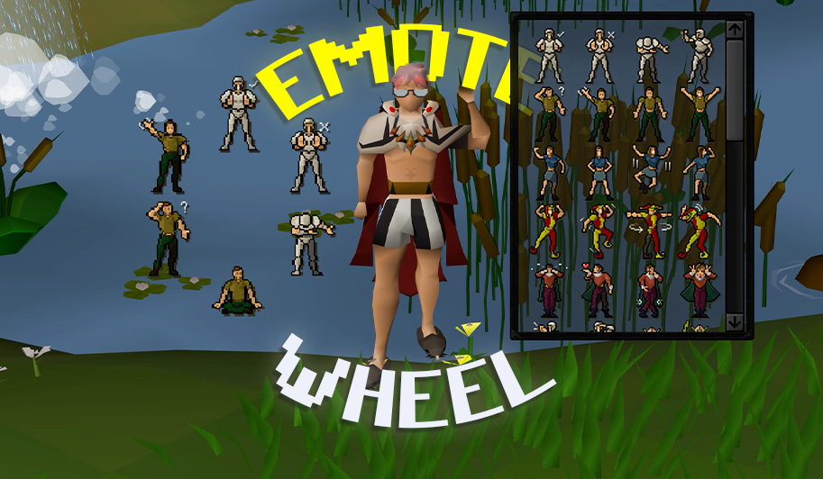
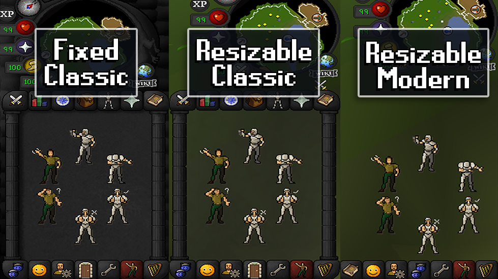
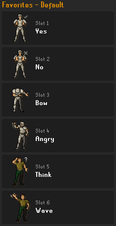
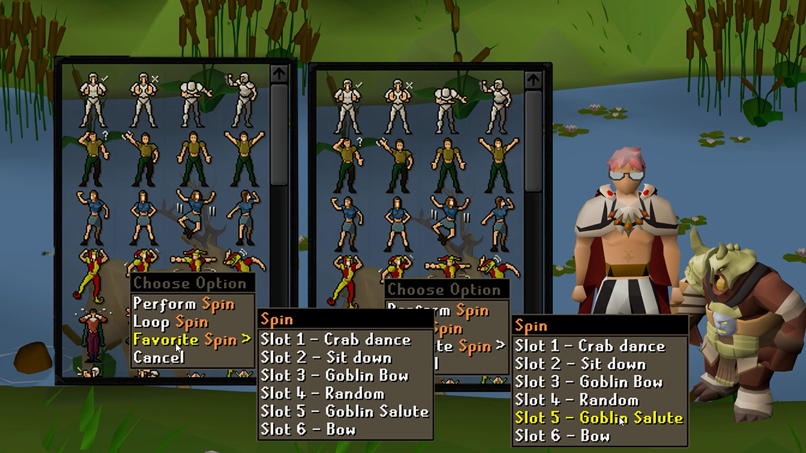
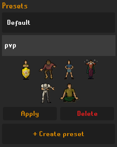
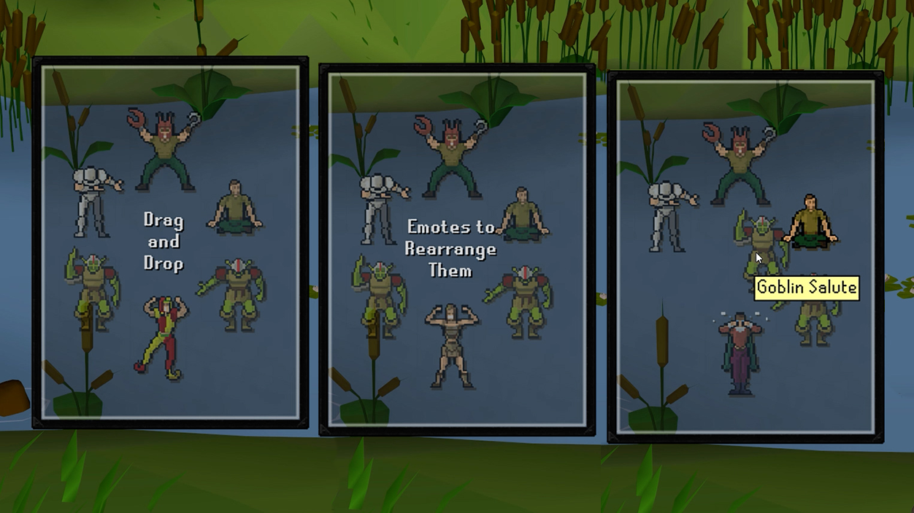
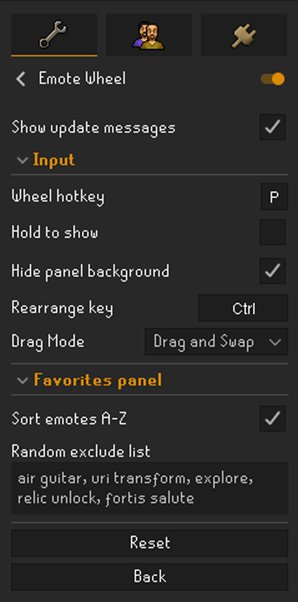

# Emote Wheel

A quality-of-life plugin that turns the emote tab into a customizable radial **wheel**.
Choose up to six favorite emotes (plus an optional **Random** slot) and perform them from
a clean ring. Every click is a genuine click on a genuine RuneScape emote widget, with no
synthetic input.

## Features

- **Six favorite slots** arranged in a ring, set from the Favorites side panel or by
  right-clicking any emote and choosing **Favorite**.
- **Favorites side panel** - a dedicated panel (its own sidebar icon) for building your
  wheel. Each slot shows the emote's real in-game icon next to its name. Tap a slot to
  pick an emote from a searchable list, and hold anywhere on a slot to drag it and
  reorder. Duplicates are blocked so an emote never lands in two slots.
- **Presets** - save the current six favorites as a named ring, then apply it any time
  with one tap. A built-in **Default** ring is always available, and the Favorites header
  shows which preset is loaded.
- **Search and sort** - start typing when a slot's picker is open to filter the emote list
  instantly, and sort it A-Z (on by default) or in the in-game tab order.
- **Random slot** that lands on a random emote each time. Clicking it performs whichever
  emote is showing, and its icon animates in the side panel. Keep specific emotes (like
  ones you have not unlocked) out of the cycle with the **Random exclude list**.
- **Hide panel background** - on the Resizable - Modern layout, hide the emote panel's
  background and frame so the emotes appear to float. The emote buttons stay fully
  clickable.
- **Drag to rearrange** - hold the rearrange key (default **Ctrl**) and drag an emote to
  reorder the wheel. Pick **Drag and Swap** (two emotes trade places), **Drag and Slot**
  (drop into a slot, the rest shift), or **None** to turn rearranging off. A plain click
  without the key always performs the emote.
- **Hotkey toggle** to switch instantly between the wheel and the normal emote grid, with
  an optional hold-to-show mode. The hotkey never fires while you are typing in chat.
- **Hover feedback** with smooth scaling and press animations, a spiral entrance, and
  smooth sliding when you rearrange.
- **Layout aware** - the full floating look is built for Resizable - Modern; the Classic
  and Fixed layouts get a clean, centered wheel on the normal panel.
- **Real widget interaction.** The plugin repositions RuneScape's existing emote widgets
  instead of simulating clicks or input, and restores the original interface whenever it
  is disabled.

## Client layouts

The floating look (hidden background) is built for the **Resizable - Modern** layout. On
**Resizable - Classic** and **Fixed - Classic** the plugin falls back to a clean, centered
wheel on the normal panel, and the "Hide panel background" option has no effect there. It
all switches automatically when you change your client layout.

## The Favorites side panel

Open the **Emote Wheel** panel from its sidebar icon to build your wheel. Each of the six
slots shows an emote's icon and name. Tap a slot and a list of emotes slides in below it -
start typing to search, or browse the list (sorted A-Z by default). Pick an emote and the
list slides closed. Emotes already used in another slot are greyed out, so you can never
double up.

To reorder, press and hold anywhere on a slot until the grab bars fade in, then drag it to
its new spot. The slot you drop into gives a little pop.

You can also set favorites straight from the emote tab: right-click an emote and choose
**Favorite** to drop it into the first open slot (or pick a slot to replace when all six
are full). With the wheel open, right-click gives **Remove** to clear a slot.

 

## Presets

Under **Presets** in the side panel, save the current six favorites as a named ring -
handy for a party set, a PvP set, or a bank-standing set. Tap a preset to preview its six
emotes, then **Apply** it or **Delete** it. The built-in **Default** ring is always there
and cannot be deleted, and the Favorites header shows the loaded preset (or "Custom" once
you change a slot).

 

## Rearranging the wheel

Hold **Ctrl** (or your chosen rearrange key) with the wheel open and drag an emote to move
it. How a drop lands is set by **Drag Mode** in the config: Drag and Swap, Drag and Slot,
or None.

## Usage

1. Enable the plugin.
2. Assign a **Wheel hotkey** in the plugin configuration.
3. Open the emote tab and press the hotkey to open the wheel.
4. Fill your six slots from the Favorites side panel, or by right-clicking emotes.
5. Set any slot to **Random** for a position that lands on a random emote.
6. Hold the **rearrange key** (default Ctrl) and drag an emote to reorder the wheel.

## Configuration

- **Wheel hotkey** - toggles the wheel on and off.
- **Hold to show** - hold the hotkey instead of toggling.
- **Rearrange key** - hold this and drag to reorder (default Ctrl).
- **Drag Mode** - Drag and Swap (default), Drag and Slot, or None.
- **Hide panel background** - hide the panel background so the emotes float. Only applies
  on the Resizable - Modern layout; Classic and Fixed keep the normal panel.
- **Sort emotes A-Z** - order the side panel's emote picker alphabetically (on by
  default); off uses the in-game tab order.
- **Random exclude list** - comma-separated emote names to keep out of the Random slot's
  cycle (for example: `Goblin Bow, Sit down`).
- **Show update messages** - print a short changelog in the chat box the first time you log
  in after the plugin updates (on by default).

 

## Notes

- Locked (dimmed) emotes can still be assigned to the wheel and can turn up in the Random
  cycle. Clicking one behaves exactly like the normal game interface. Add them to the
  **Random exclude list** by name if you want them out of Random.
- To make the emotes larger, use the
  [Stretched Mode](https://github.com/runelite/runelite/wiki/Stretched-Mode) plugin to
  scale the whole game UI - the wheel follows the emote panel's size. It pairs well with
  Hide panel background for an oversized floating set.
- The plugin only repositions existing RuneScape widgets and stores its own
  configuration. It performs no automated game actions or synthetic input.
