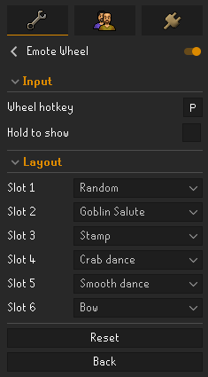

# Emote Wheel

A quality-of-life plugin that transforms the emote tab into a customizable radial **wheel**. Choose up to six favourite emotes (plus an optional **Random** slot), then perform them using the original in-game emote widgets. Every click is a genuine click on a genuine RuneScape widget, with no synthetic input.

## Features

- **Six favourite slots** arranged in a ring, configured from the side panel or by right-clicking any emote and choosing **Favorite → Slot N**.
- **Random slot** that cycles through your unlocked emotes like a slot machine. Clicking it performs whichever emote is currently showing.
- **Hotkey toggle** to instantly switch between the radial wheel and the normal emote grid, with an optional hold-to-show mode.
- **Hover feedback** with smooth scaling and press animations that make the wheel feel responsive.
- **Spiral entrance animation** as the wheel expands into place.
- **Real widget interaction**. The plugin rearranges RuneScape's existing emote widgets instead of simulating clicks or input.
- **Persistent configuration**. Your wheel layout is remembered between sessions and the original emote interface is restored whenever the plugin is disabled.

## See it in action

| Right-click to favourite | Configure your wheel |
| :---: | :---: |
|  |  |

## Usage

1. Enable the plugin.
2. Assign a **Wheel Hotkey** in the plugin configuration.
3. Open the emote tab.
4. Press the hotkey to open the wheel.
5. Fill your six slots either by:
   - selecting emotes in the configuration panel, or
   - right-clicking any emote and choosing **Favorite → Slot N**.
6. Set any slot to **Random** if you'd like that position to cycle through unlocked emotes.

## Configuration

- **Wheel Hotkey** - Toggles the wheel on and off.
- **Hold to show** - Hold the hotkey instead of toggling.
- **Slots 1-6** - Choose an emote, **Random**, or **None** for each position.

## Notes

- Locked (dimmed) emotes can still be assigned to the wheel. Clicking them behaves exactly like the normal game interface and simply does nothing.
- The plugin only rearranges existing RuneScape widgets and stores its own configuration. It performs no automated game actions or synthetic input.
