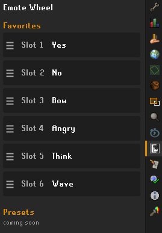
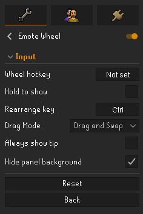

# Emote Wheel

A quality-of-life plugin that turns the emote tab into a customizable radial **wheel**.
Choose up to six favorite emotes (plus an optional **Random** slot) and perform them from
a clean ring. Every click is a genuine click on a genuine RuneScape emote widget, with no
synthetic input.

## Features

- **Six favorite slots** arranged in a ring, set from the Favorites side panel or by
  right-clicking any emote and choosing **Favorite**.
- **Favorites side panel** - a dedicated panel (its own sidebar icon) for building your
  wheel: tap a slot to pick an emote from a list, drag the handle to reorder, and
  duplicates are blocked so an emote never lands in two slots.
- **Hide panel background** - on the Resizable - Modern layout, hide the emote panel's
  background and frame so the emotes appear to float. The emote buttons stay fully
  clickable.
- **Drag to rearrange** - hold the rearrange key (default **Ctrl**) and drag an emote to
  reorder the wheel. Pick **Drag and Swap** (two emotes trade places) or **Drag and
  Slot** (drop into a slot, the rest shift). A plain click without the key always
  performs the emote.
- **Random slot** that cycles through your unlocked emotes like a slot machine. Clicking
  it performs whichever emote is currently showing.
- **Hotkey toggle** to switch instantly between the wheel and the normal emote grid, with
  an optional hold-to-show mode. The hotkey never fires while you are typing in chat.
- **Hover feedback** with smooth scaling and press animations, a spiral entrance, and
  smooth sliding when you rearrange.
- **Layout aware** - the full floating look is built for Resizable - Modern; the Classic
  and Fixed layouts get a clean, centered wheel on the normal panel.
- **Real widget interaction.** The plugin repositions RuneScape's existing emote widgets
  instead of simulating clicks or input, and restores the original interface whenever it
  is disabled.

## The Favorites side panel

Open the **Emote Wheel** panel from its sidebar icon to build your wheel. Each of the six
slots is a button - tap one and a list of emotes slides in below it. Pick an emote and the
list slides closed. Emotes already used in another slot are greyed out, so you can never
double up. Grab the handle on the left of a slot to drag it and reorder the wheel.

You can also set favorites straight from the emote tab: right-click an emote and choose
**Favorite** to drop it into the first open slot (or pick a slot to replace when all six
are full). With the wheel open, right-click gives **Remove** to clear a slot.

 

## Rearranging the wheel

Hold **Ctrl** (or your chosen rearrange key) with the wheel open and drag an emote to move
it. A short built-in tip walks you through it and then hides itself once you have done a
rearrange.

## Client layouts

The floating look (hidden background, offset wheel) is built for the **Resizable - Modern**
layout. On **Resizable - Classic** and **Fixed - Classic** the plugin falls back to a
clean, centered wheel on the normal panel, and the "Hide panel background" option has no
effect there. It all switches automatically when you change your client layout.

## Making the emotes bigger

The emote wheel uses the game's real emote widgets, so its size follows the emote panel.
If you would like the whole interface (emotes included) larger, use the
[**Stretched Mode**](https://github.com/runelite/runelite/wiki/Stretched-Mode) plugin,
which scales the entire game UI to your window. Combined with **Hide panel background** on
Resizable - Modern, a bit of upscaling makes for a clean, oversized set of floating
emotes.

## Usage

1. Enable the plugin.
2. Assign a **Wheel hotkey** in the plugin configuration.
3. Open the emote tab and press the hotkey to open the wheel.
4. Fill your six slots from the Favorites side panel, or by right-clicking emotes.
5. Set any slot to **Random** for a position that cycles through unlocked emotes.
6. Hold the **rearrange key** (default Ctrl) and drag an emote to reorder the wheel.

## Configuration

- **Wheel hotkey** - toggles the wheel on and off.
- **Hold to show** - hold the hotkey instead of toggling.
- **Rearrange key** - hold this and drag to reorder (default Ctrl).
- **Drag Mode** - Drag and Swap (default) or Drag and Slot.
- **Always show tip** - keep the rearrange tip showing (it auto-hides once you have
  rearranged once).
- **Hide panel background** - hide the panel background so the emotes float. Only applies
  on the Resizable - Modern layout; Classic and Fixed keep the normal panel.

Slots are set in the **Favorites side panel**, not here.

## Notes

- Locked (dimmed) emotes can still be assigned to the wheel. Clicking one behaves exactly
  like the normal game interface and simply does nothing.
- The plugin only repositions existing RuneScape widgets and stores its own
  configuration. It performs no automated game actions or synthetic input.
