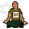

# Emote Wheel

A quality-of-life plugin that rearranges your favourite emotes into a radial
**wheel** inside the emote tab. It moves the *real* game emote widgets into a
ring, so every click is a genuine click on a genuine emote — no synthetic input.

<!-- Replace the line above with a real screenshot or gif once you have one. -->

## Features

- **Six favourite slots** arranged in a ring, set from the side panel or by
  right-clicking any emote in the tab and choosing **Favorite → Slot N**.
- **Hotkey toggle** — press to show the wheel, press again for the normal grid.
  Optional hold-to-show mode.
- **Hover feedback** — the emote under the cursor scales up while the others fade
  back, with a smooth press-dip when you click.
- **Spiral entrance** — the emotes spiral out into the ring when the wheel opens.
- **Random slot** — a "slot machine" that cycles real unlocked emotes; clicking
  it performs whichever one is showing (a real click on a real button).
- **Remembers its state** between sessions, and restores the normal emote menu
  untouched when toggled off.

## Usage

1. Set the **Wheel hotkey** in the plugin config.
2. Open the emote tab and press the hotkey to raise the wheel.
3. Choose your six favourites in the config, or right-click an emote in the tab
   and pick **Favorite → Slot N**. With the wheel on, right-click gives **Remove**
   to clear a slot.

## Configuration

- **Wheel hotkey** — key that toggles the wheel on and off.
- **Hold to show** — toggle mode (default) vs. hold-to-show.
- **Slots 1–6** — the emotes on the wheel; set to *None* to leave a slot out, or
  *Random* for the random slot.

## Notes

- Locked (dimmed) emotes can be placed on the wheel; clicking one simply does
  nothing, exactly as the game already enforces.
- The plugin only rearranges existing widgets and edits its own configuration —
  it performs no game actions on your behalf.
