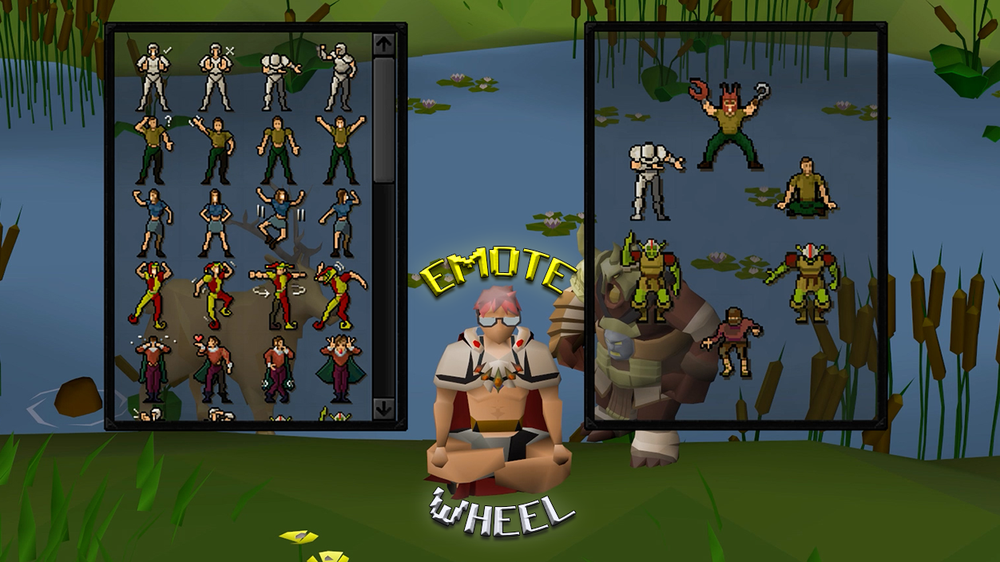

# Emote Wheel

A quality-of-life plugin that rearranges your favorite emotes into a radial
**wheel** inside the emote tab. It moves the *real* game emote widgets into a
ring, so every click is a genuine click on a genuine emote - no synthetic input.

## Features

- **Six favorite slots** arranged in a ring, set from the side panel or by
  right-clicking any emote in the tab and choosing **Favorite -> Slot N**.
- **Hotkey toggle** - press to show the wheel, press again for the normal grid.
  Optional hold-to-show mode. The hotkey never fires while you are typing in chat.
- **Drag to rearrange** - hold the rearrange key (default **Ctrl**) and drag an
  emote to reorder the wheel. Choose **Drag and Swap** (two emotes trade places)
  or **Drag and Slot** (drop into a slot, the rest shift) in the config. A plain
  click without the key always performs the emote.
- **Hover feedback** - the emote under the cursor scales up while the others fade
  back, with a smooth press-dip when you click.
- **Spiral entrance** - the emotes spiral out into the ring when the wheel opens,
  and slide smoothly into place when you rearrange them.
- **Random slot** - a "slot machine" that cycles real unlocked emotes; clicking
  it performs whichever one is showing (a real click on a real button).
- **Remembers its state** between sessions, and restores the normal emote menu
  untouched when toggled off.

## Rearranging the wheel

Hold **Ctrl** (or your chosen rearrange key) with the wheel open and drag an emote
to move it. A short built-in tip walks you through it the first few times and then
hides itself once you have done a rearrange.

## See it in action

| Right-click to favorite | Configure your six slots |
| :---: | :---: |
|  |  |

## Usage

1. Set the **Wheel hotkey** in the plugin config.
2. Open the emote tab and press the hotkey to raise the wheel.
3. Choose your six favorites in the config, or right-click an emote in the tab
   and pick **Favorite -> Slot N**. With the wheel on, right-click gives **Remove**
   to clear a slot.
4. Hold the **rearrange key** (default Ctrl) and drag an emote to reorder the wheel.

## Configuration

- **Wheel hotkey** - key that toggles the wheel on and off.
- **Hold to show** - toggle mode (default) vs. hold-to-show.
- **Rearrange key** - hold this and drag to reorder (default Ctrl).
- **Drag Mode** - Drag and Swap (default) or Drag and Slot.
- **Always show tip** - keep the rearrange tutorial tip showing (it auto-hides once
  you have rearranged once).
- **Slots 1-6** - the emotes on the wheel; set to *None* to leave a slot out, or
  *Random* for the random slot.

## Notes

- Locked (dimmed) emotes can be placed on the wheel; clicking one simply does
  nothing, exactly as the game already enforces.
- The plugin only rearranges existing widgets and edits its own configuration - it
  performs no game actions on your behalf.
